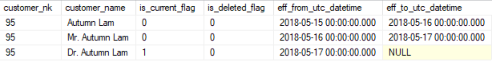

### Ticket Number: INT-950

#### **Goal**

>*As a* developer
>*I want* all customer information to be loaded into `sales.dim_customer`
>*So that* It supports dim lookups

#### **Background**

The stored procedure `etl.usp_load_event` inserts data into `stage.sales_event_data` periodically. The events are a collection of **Order's** placed. It **ALSO** contains nested customer information.

The structure is _well defined_ and static.

#### **Single Event Structure:**

The below is the structure of a single event.

```json
    {
        "order_date": "2019-07-07",
        "order_id": 1,
        "order_notes": "VUX22019 | Direct | Cutomer",
        "customer": [
            {
                "customer_id": 95,
                "customer_name": "Autumn Lam"
            }
        ],
        "products": [
            {
                "product_id": 82,
                "product_name": "Admunewower",
                "order_quantity": 15
            }
        ],
        "supplier": [
            {
                "supplier_id": 82,
                "supplier_name": "Barquestantor  "
            }
        ]
    }
```

**Notes:**

- There is **ONLY** one customer per order
- Customer information is **duplicated** across orders.
- Customer information within a `event_id` is the same apply **SCD2** across Batches
- `eff_from_utc_datetime` is the `etl.input_file.business_date`
- SCD2
  - `eff_to_utc_datetime` is `etl.input_file.business_date`
  - `eff_to_utc_datetime` is `etl.input_file.business_date` for the batch that **expired** this
  - `eff_to_utc_datetime` is `NULL` for current records
  - _Example SCD2 after `event_id` (1,2,3)_
  - 
- All customers can be uniquely identified with `customer_id`

**Scope:**

- Loading the same `event_data` twice should not cause duplicates
- Load data **ONLY** into `sales.dim_customer`

**Notes:**

- Create a Stored Procedure `sales.usp_load_fact_dim_customer`
- With a parameter `@event_id INT`
- You are **ALLOWED** to use an alternate to stored-procedures but you must document how to use it.

**Evaluation Questions:**

- Can I use any tool/process : *Yes*
- Does it matter what tool/process I use: *Ideally we like to see stored-procs but you are free and will be evaluated.*

**Reference Materials:**

- JSON in SQL Server with [OPENJSON](https://docs.microsoft.com/en-us/sql/t-sql/functions/openjson-transact-sql?view=sql-server-2017)
- Sample Usage of [OPENJSON](https://docs.microsoft.com/en-us/sql/relational-databases/json/convert-json-data-to-rows-and-columns-with-openjson-sql-server?view=sql-server-2017)
