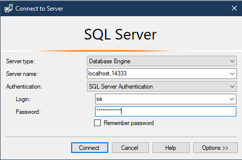

# FAQ

This document contains some basic Q/A in regards to setting up.

## _default_ Credentials 

- **SQL Server Login**: `sa`
- **SQL Server Password**: `C0mplexPassw0rd!` (or value of `SA_PASSWORD` in `\docker-compose.yml`)
- **SQL Server Port**: `14333`

## Common Questions

||
|:--|
|**Q:** What is the docker command I need to run|
|**A:** `docker-compose -f "docker-compose.yml" up -d --build`|
|**Q:** Creating `aletasystemsroledataengineer_inittools_1` fails|
|**A:** This is a docker problem, restart your docker machine|
